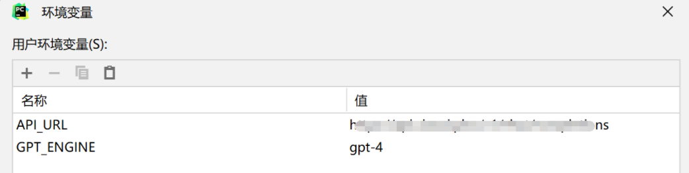
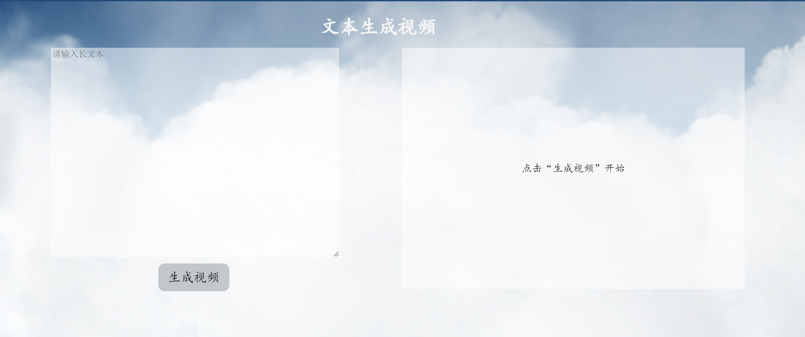
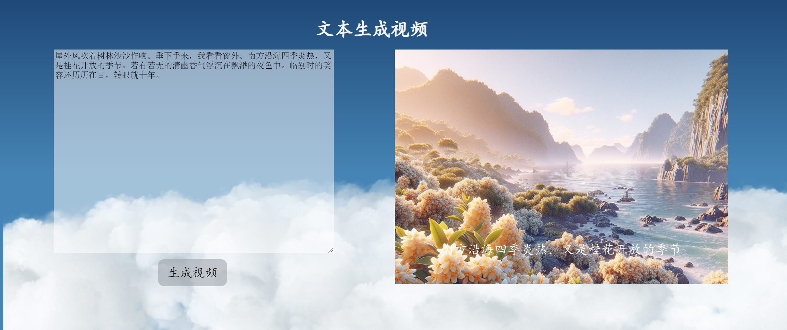

这是一个利用文本生成视频的项目，帮助视频制作者一键生成视频。


# 使用方法

## 环境准备

创建虚拟环境，python版本为3.10

```
conda create -n yourEnv python=3.6
```

激活

windows ==>

```python
activate yourEnv
```

 linux/mac ==>

```python
source activate yourEnv
```

安装需要的包

```python
pip install -r requirements.txt
```

生成视频用到了moviepy，需要安装ImageMagick，安装方法参考

[1]: https://blog.csdn.net/popboy29/article/details/135587838?spm=1001.2101.3001.6650.2&utm_medium=distribute.pc_relevant.none-task-blog-2%7Edefault%7ECTRLIST%7ERate

安装完成后将data_to_vedio.py中的os.environ["IMAGEMAGICK_BINARY"]替换为你自己的路径

## API准备

1.openai api申请

2.微软TTS API申请，可以参考：

[2]: https://blog.csdn.net/suiyueruge1314/article/details/126445921

将获取的API配置信息填入data.csv中

3.在环境变量中填入你的API_URL和设备名称



4.将data_to_image.py中的base_url替换为你自己的url

## 项目启动

1. 运行根目录下的app.py
2. 打开浏览器http://127.0.0.1:5000/，如下图

3.生成结果如图

## 视频生成

项目正式启动后，直接在文本框中输入内容，点击生成视频即可。

生成的分句存在：data/data_split

生成的图片描述存在：data/data_prompt

生成的音频存在：data/data_audio

生成的图片存在：data/data_image

生成的视频存在：data/data_vedio

## 代码解释

0、项目启动

```python
app.py
```

1、切割源文件，句号分割语料，形成新的文件。

```python
data_split.py
```

2、利用chatgpt生成图片描述，prompt。

```python
data_promt_words.py
```

3、利用第1步的语料，调用tts的api生成语音。

```python
data_tts.py
```

4、利用第2步生成提示词，调用openai的api生成图片。或者调用midjourney的api生成视频。

```python
data_to_image.py
```

5、将第3步的语音和第4步的图片合成视频。

```python
data_to_vedio.py
```

6、页面html文件

```
templates/cloud/index.html
```

7.页面静态文件

```
static
```
本项目基于：

https://github.com/guifaChild/text_to_vedio_web

